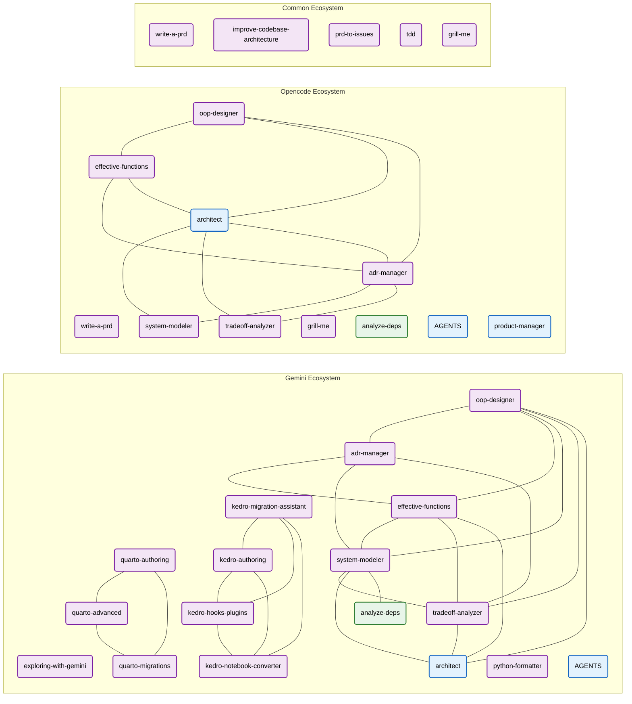

# Repository Knowledge Graph

```mermaid
graph LR
    subgraph GEMINI_PLATFORM [Gemini Ecosystem]
        gemini__exploring-with-gemini(exploring-with-gemini):::skillStyle
        gemini__quarto-authoring(quarto-authoring):::skillStyle
        gemini__quarto-advanced(quarto-advanced):::skillStyle
        gemini__quarto-migrations(quarto-migrations):::skillStyle
        gemini__kedro-migration-assistant(kedro-migration-assistant):::skillStyle
        gemini__kedro-authoring(kedro-authoring):::skillStyle
        gemini__kedro-hooks-plugins(kedro-hooks-plugins):::skillStyle
        gemini__kedro-notebook-converter(kedro-notebook-converter):::skillStyle
        gemini__oop-designer(oop-designer):::skillStyle
        gemini__adr-manager(adr-manager):::skillStyle
        gemini__effective-functions(effective-functions):::skillStyle
        gemini__system-modeler(system-modeler):::skillStyle
        gemini__tradeoff-analyzer(tradeoff-analyzer):::skillStyle
        gemini__architect(architect):::agentStyle
        gemini__python-formatter(python-formatter):::skillStyle
        gemini__analyze-deps(analyze-deps):::commandStyle
        gemini__AGENTS(AGENTS):::agentStyle
    end
    subgraph OPENCODE_PLATFORM [Opencode Ecosystem]
        opencode__write-a-prd(write-a-prd):::skillStyle
        opencode__oop-designer(oop-designer):::skillStyle
        opencode__effective-functions(effective-functions):::skillStyle
        opencode__architect(architect):::agentStyle
        opencode__adr-manager(adr-manager):::skillStyle
        opencode__system-modeler(system-modeler):::skillStyle
        opencode__tradeoff-analyzer(tradeoff-analyzer):::skillStyle
        opencode__grill-me(grill-me):::skillStyle
        opencode__analyze-deps(analyze-deps):::commandStyle
        opencode__AGENTS(AGENTS):::agentStyle
        opencode__product-manager(product-manager):::agentStyle
    end
    subgraph COMMON_PLATFORM [Common Ecosystem]
        common__write-a-prd(write-a-prd):::skillStyle
        common__improve-codebase-architecture(improve-codebase-architecture):::skillStyle
        common__prd-to-issues(prd-to-issues):::skillStyle
        common__tdd(tdd):::skillStyle
        common__grill-me(grill-me):::skillStyle
    end
    opencode__oop-designer --- opencode__effective-functions
    opencode__oop-designer --- opencode__architect
    opencode__oop-designer --- opencode__adr-manager
    opencode__effective-functions --- opencode__adr-manager
    opencode__effective-functions --- opencode__architect
    opencode__architect --- opencode__system-modeler
    opencode__architect --- opencode__tradeoff-analyzer
    opencode__architect --- opencode__adr-manager
    opencode__adr-manager --- opencode__system-modeler
    opencode__adr-manager --- opencode__tradeoff-analyzer
    gemini__quarto-authoring --- gemini__quarto-advanced
    gemini__quarto-authoring --- gemini__quarto-migrations
    gemini__quarto-advanced --- gemini__quarto-migrations
    gemini__kedro-migration-assistant --- gemini__kedro-authoring
    gemini__kedro-migration-assistant --- gemini__kedro-hooks-plugins
    gemini__kedro-migration-assistant --- gemini__kedro-notebook-converter
    gemini__kedro-authoring --- gemini__kedro-hooks-plugins
    gemini__kedro-authoring --- gemini__kedro-notebook-converter
    gemini__kedro-hooks-plugins --- gemini__kedro-notebook-converter
    gemini__oop-designer --- gemini__adr-manager
    gemini__oop-designer --- gemini__effective-functions
    gemini__oop-designer --- gemini__system-modeler
    gemini__oop-designer --- gemini__tradeoff-analyzer
    gemini__oop-designer --- gemini__architect
    gemini__adr-manager --- gemini__effective-functions
    gemini__adr-manager --- gemini__system-modeler
    gemini__adr-manager --- gemini__tradeoff-analyzer
    gemini__effective-functions --- gemini__system-modeler
    gemini__effective-functions --- gemini__tradeoff-analyzer
    gemini__effective-functions --- gemini__architect
    gemini__system-modeler --- gemini__tradeoff-analyzer
    gemini__system-modeler --- gemini__architect
    gemini__system-modeler --- gemini__analyze-deps
    gemini__tradeoff-analyzer --- gemini__architect
    classDef skillStyle fill:#f3e5f5,stroke:#7b1fa2,stroke-width:2px,color:#000
    classDef agentStyle fill:#e3f2fd,stroke:#1565c0,stroke-width:2px,color:#000
    classDef commandStyle fill:#e8f5e9,stroke:#2e7d32,stroke-width:2px,color:#000
```
