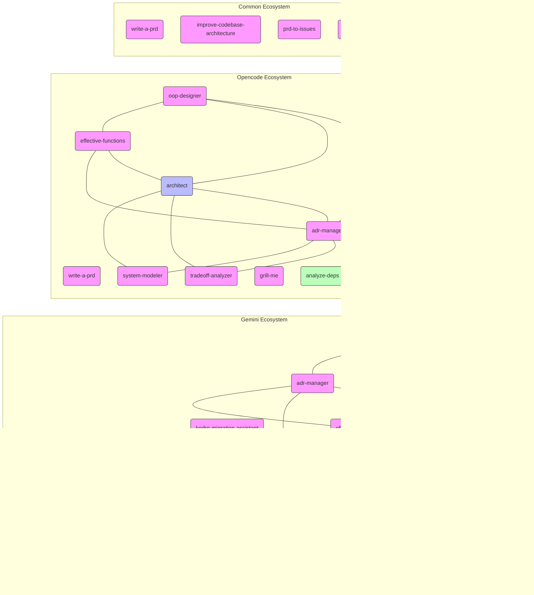

# Repository Knowledge Graph

```mermaid
graph LR
    subgraph GEMINI_PLATFORM [Gemini Ecosystem]
        gemini_exploring-with-gemini(exploring-with-gemini):::skillStyle
        gemini_quarto-authoring(quarto-authoring):::skillStyle
        gemini_quarto-advanced(quarto-advanced):::skillStyle
        gemini_quarto-migrations(quarto-migrations):::skillStyle
        gemini_kedro-migration-assistant(kedro-migration-assistant):::skillStyle
        gemini_kedro-authoring(kedro-authoring):::skillStyle
        gemini_kedro-hooks-plugins(kedro-hooks-plugins):::skillStyle
        gemini_kedro-notebook-converter(kedro-notebook-converter):::skillStyle
        gemini_oop-designer(oop-designer):::skillStyle
        gemini_adr-manager(adr-manager):::skillStyle
        gemini_effective-functions(effective-functions):::skillStyle
        gemini_system-modeler(system-modeler):::skillStyle
        gemini_tradeoff-analyzer(tradeoff-analyzer):::skillStyle
        gemini_architect(architect):::agentStyle
        gemini_python-formatter(python-formatter):::skillStyle
        gemini_analyze-deps(analyze-deps):::commandStyle
        gemini_AGENTS(AGENTS):::agentStyle
    end
    subgraph OPENCODE_PLATFORM [Opencode Ecosystem]
        opencode_write-a-prd(write-a-prd):::skillStyle
        opencode_oop-designer(oop-designer):::skillStyle
        opencode_effective-functions(effective-functions):::skillStyle
        opencode_architect(architect):::agentStyle
        opencode_adr-manager(adr-manager):::skillStyle
        opencode_system-modeler(system-modeler):::skillStyle
        opencode_tradeoff-analyzer(tradeoff-analyzer):::skillStyle
        opencode_grill-me(grill-me):::skillStyle
        opencode_analyze-deps(analyze-deps):::commandStyle
        opencode_AGENTS(AGENTS):::agentStyle
        opencode_product-manager(product-manager):::agentStyle
    end
    subgraph COMMON_PLATFORM [Common Ecosystem]
        common_write-a-prd(write-a-prd):::skillStyle
        common_improve-codebase-architecture(improve-codebase-architecture):::skillStyle
        common_prd-to-issues(prd-to-issues):::skillStyle
        common_tdd(tdd):::skillStyle
        common_grill-me(grill-me):::skillStyle
    end
    opencode_oop-designer --- opencode_effective-functions
    opencode_oop-designer --- opencode_architect
    opencode_oop-designer --- opencode_adr-manager
    opencode_effective-functions --- opencode_adr-manager
    opencode_effective-functions --- opencode_architect
    opencode_architect --- opencode_system-modeler
    opencode_architect --- opencode_tradeoff-analyzer
    opencode_architect --- opencode_adr-manager
    opencode_adr-manager --- opencode_system-modeler
    opencode_adr-manager --- opencode_tradeoff-analyzer
    gemini_quarto-authoring --- gemini_quarto-advanced
    gemini_quarto-authoring --- gemini_quarto-migrations
    gemini_quarto-advanced --- gemini_quarto-migrations
    gemini_kedro-migration-assistant --- gemini_kedro-authoring
    gemini_kedro-migration-assistant --- gemini_kedro-hooks-plugins
    gemini_kedro-migration-assistant --- gemini_kedro-notebook-converter
    gemini_kedro-authoring --- gemini_kedro-hooks-plugins
    gemini_kedro-authoring --- gemini_kedro-notebook-converter
    gemini_kedro-hooks-plugins --- gemini_kedro-notebook-converter
    gemini_oop-designer --- gemini_adr-manager
    gemini_oop-designer --- gemini_effective-functions
    gemini_oop-designer --- gemini_system-modeler
    gemini_oop-designer --- gemini_tradeoff-analyzer
    gemini_oop-designer --- gemini_architect
    gemini_adr-manager --- gemini_effective-functions
    gemini_adr-manager --- gemini_system-modeler
    gemini_adr-manager --- gemini_tradeoff-analyzer
    gemini_effective-functions --- gemini_system-modeler
    gemini_effective-functions --- gemini_tradeoff-analyzer
    gemini_effective-functions --- gemini_architect
    gemini_system-modeler --- gemini_tradeoff-analyzer
    gemini_system-modeler --- gemini_architect
    gemini_system-modeler --- gemini_analyze-deps
    gemini_tradeoff-analyzer --- gemini_architect
    classDef skillStyle fill:#f9f,stroke:#333
    classDef agentStyle fill:#bbf,stroke:#333
    classDef commandStyle fill:#bfb,stroke:#333
```
