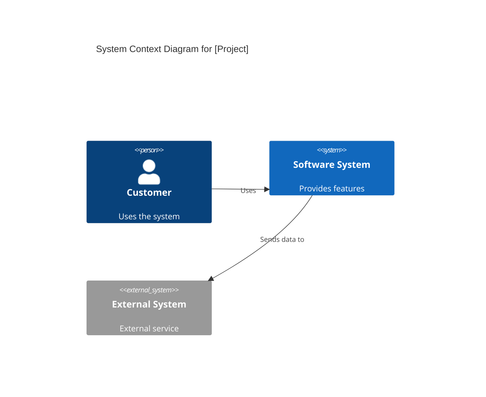

# System Modeler (C4 & Mermaid)

A picture is worth a thousand lines of code. This skill helps you visualize the system's structure at different levels of abstraction.

## Diagram Types (C4 Model)

### 1. System Context Diagram (L1)
Shows the system as a whole and its interactions with external users and systems.
- **Focus**: Scope and high-level boundaries.

### 2. Container Diagram (L2)
Shows the high-level technical building blocks (web apps, databases, file systems, microservices).
- **Focus**: Technology choices and communication protocols.

### 3. Component Diagram (L3)
Shows the internal components within a container (e.g., controllers, services, repositories).
- **Focus**: Internal structure and responsibilities.

## Workflow

1.  **Analyze**: Run `uv run gemini/commands/dependency-analyzer.py .` to get a structured view of the current files and dependencies.
2.  **Select Level**: Decide which C4 level is most appropriate for the current task.
3.  **Generate Mermaid**: Create the diagram using Mermaid.js syntax.

4.  **Save/Render**: Include the Mermaid code in your response or save it to a `.md` file in `docs/architecture/`.

## Best Practices
- **Consistent Naming**: Use the same names for systems and containers across all diagrams.
- **Explain Arrows**: Always label relationships with a description (e.g., "Uses HTTPS", "Sends JSON").
- **Simplicity**: Avoid "spaghetti" diagrams. If a diagram is too complex, split it into smaller ones.
