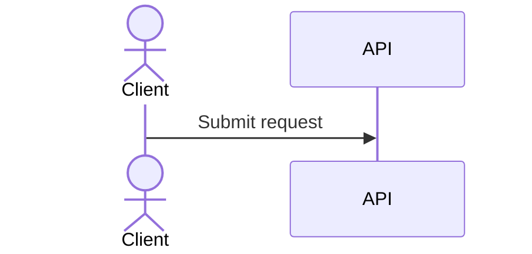
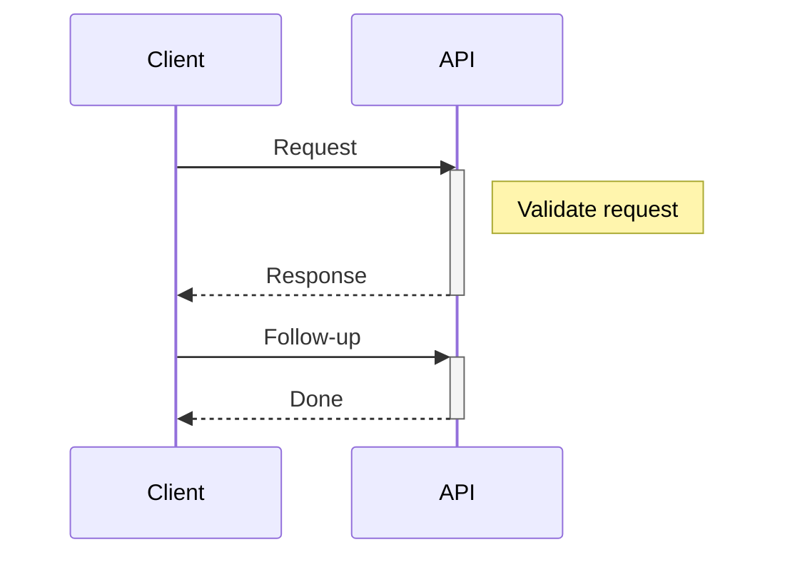
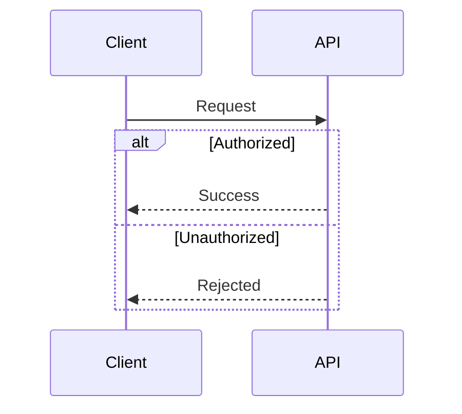

# Mermaid Sequence Diagram Reference

Use sequence diagrams for chronological exchanges between participants. Use swimlanes for process ownership and flowcharts for branching, data, or process flow.

## Declaration and participants

Start with `sequenceDiagram`. Participants can be declared explicitly with stable aliases and display names. Implicit participants appear in first-use order; declare them explicitly when stable ordering matters.

## Messages

Label consequential messages. Use the simplest arrow that communicates the exchange.

| Arrow | Meaning |
| --- | --- |
| `->>` | Solid arrow |
| `-->>` | Dotted arrow |
| `->` | Solid line without arrowhead |
| `-->` | Dotted line without arrowhead |
| `-x` | Solid line with a cross ending |
| `-)` | Solid line with an open ending |

## Activation and notes

Use `activate` and `deactivate` explicitly, or append `+` and `-` to a message arrow as shortcuts. Stacked activations are permitted.

Notes can be placed `left of`, `right of`, or `over` one or more participants.

## Control blocks

Use `loop`, `alt` with `else`, `opt`, `par` with `and`, `critical` with `option`, and `break` to describe temporal control. Terminate every block with lowercase `end`.

## Lifecycle

Use create and destroy syntax only when lifecycle is part of the interaction. Creation must be tied to a message whose recipient is the created participant; keep the creation declaration and its message together. Use a destruction message when removing a participant, and verify support in the target renderer.

## Guardrails

- Keep the diagram temporal; do not use it to model ownership or general process branching.
- Declare participants explicitly when stable ordering matters.
- Label consequential messages and keep branches readable.
- Do not use literal unescaped lowercase `end` as message text.

## Pitfalls and compatibility

- Write prose `end` as `(end)`, `[end]`, or `{end}`; literal lowercase `end` conflicts with block termination.
- Write a literal semicolon as `#59;`.
- Put comments on their own line beginning with `%%`.
- Confirm the host Mermaid version before using newer syntax: bidirectional arrows require v11.0.0+, half/central arrows require v11.12.3+, and creation/destruction requires v10.3.0+ with fixes in v10.7.0+.

## Explore further

This focused reference intentionally does not cover: participant stereotypes and aliases, participant grouping with `box`, actor creation and destruction constraints, bidirectional and half-arrow variants, sequence numbering and `autonumber`, entity codes for escaping syntax. See the [official Mermaid reference](https://mermaid.js.org/syntax/sequenceDiagram.html).

## Official documentation

- [Mermaid sequence diagram syntax](https://mermaid.js.org/syntax/sequenceDiagram.html)
