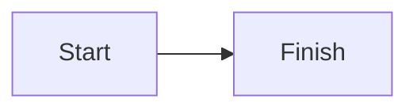
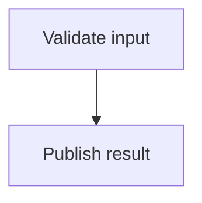
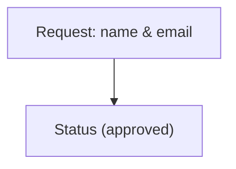
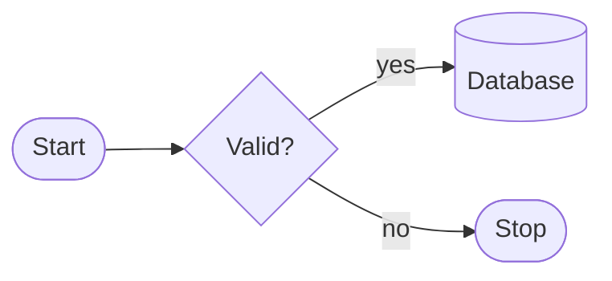
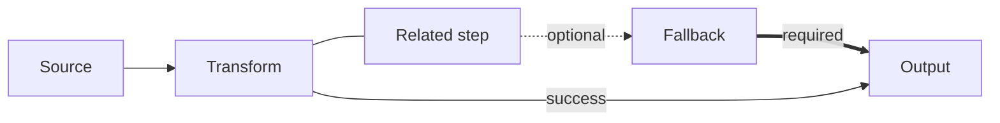
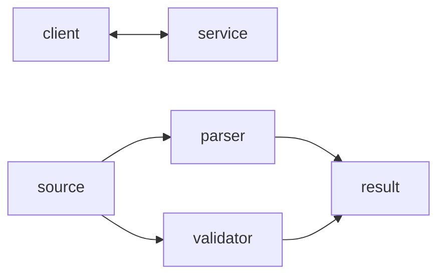
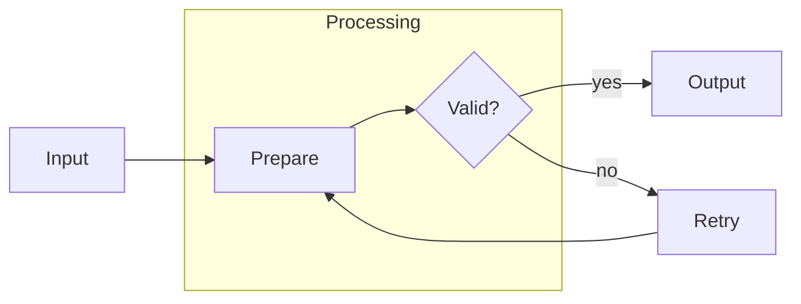

# Mermaid Flowchart Syntax Reference

Use this reference only for Mermaid flowcharts. Examples are compact, valid Mermaid blocks; render them in the target environment before publishing.

## Minimal workflow

1. Identify the steps, decisions, and direction of travel.
2. Declare the direction, then add stable IDs and readable labels.
3. Use the simplest shapes, links, and subgraphs that communicate the flow.
4. Render and validate the completed block in its target renderer.

## Guardrails

- Keep each diagram focused on one flow; split unrelated flows.
- Apply the node and link rules below for stable IDs, readable labels, quoted special-character labels, and avoiding bare lowercase `end` as an ID.
- Do not use artificially long links to force layout; use a clearer flow structure instead.
- Validate in the target renderer and stay within Mermaid flowchart syntax; do not add other diagram types, styling, or theming.

## Declaration and directions

Start with `flowchart` (or the compatible `graph`) and a direction: `TB` (top to bottom), `TD` (top down), `BT` (bottom to top), `LR` (left to right), or `RL` (right to left).

## Node IDs and labels

The ID is the internal, reusable identifier; the label is the visible text. Keep IDs stable when editing a diagram, and use a clear label for readers. Repeating an ID updates or reuses that node.

Quote labels containing special characters, punctuation that could be parsed as syntax, or text that needs literal treatment.

Do not use lowercase `end` as a node ID: Mermaid recognizes it as the end of a `subgraph`. Use an ID such as `finish` instead.

## Common shapes

Choose shapes sparingly to clarify meaning. Rectangles are the default; diamonds commonly represent decisions, stadiums starts or ends, and cylinders data stores.

Useful forms include:

| Meaning | Syntax |
| --- | --- |
| Rectangle | `id[Label]` or `id` |
| Rounded rectangle | `id(Label)` |
| Stadium | `id([Label])` |
| Decision diamond | `id{Label}` |
| Circle | `id((Label))` |
| Cylinder / database | `id[(Label)]` |

The default rectangle is sufficient for most process steps. Verify the rendered output when shape semantics matter.

## Arrows, lines, and labels

Use solid arrows for directed flow. A plain line has no arrowhead; dotted and thick arrows can distinguish a relationship when needed. Put labels between the link markers.

Common link forms:

| Link | Syntax |
| --- | --- |
| Solid arrow | `a --> b` |
| Plain line | `a --- b` |
| Dotted arrow | `a -.-> b` |
| Thick arrow | `a ==> b` |
| Labelled arrow | `a -->|label| b` |
| Labelled dotted arrow | `a -. label .-> b` |

Avoid using extra dashes merely to force layout. Excessive edge length makes diagrams fragile and harder to read.

## Bidirectional and multi-directional links

Use a bidirectional arrow when the relationship genuinely flows both ways. For fan-out or fan-in, Mermaid lets one statement connect multiple nodes using `&`.

This is equivalent to declaring each individual edge, but is more compact for simple parallel relationships. Use separate links when each relationship needs a distinct label.

## Subgraphs and external links

Use a `subgraph` to group a cohesive part of a flow. Give it a stable ID and a readable title. Nodes outside the group can link to nodes inside it and nodes inside it can link out.

If a subgraph has external links, the renderer may use the parent diagram direction instead of the subgraph's declared direction. Keep the group small and validate the rendered diagram rather than relying on forced layout.

## Practical checklist

- Declare the direction first.
- Use stable IDs and readable labels.
- Quote labels with special characters.
- Never use lowercase `end` as a node ID.
- Use the shortest meaningful link syntax; do not create excessive edge length for layout.
- Keep subgraph boundaries meaningful and verify links that cross them.

## Official documentation

- [Mermaid flowchart syntax](https://mermaid.js.org/syntax/flowchart.html)
