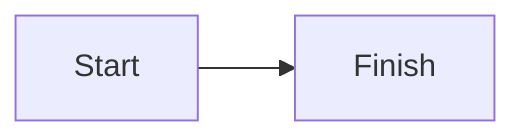
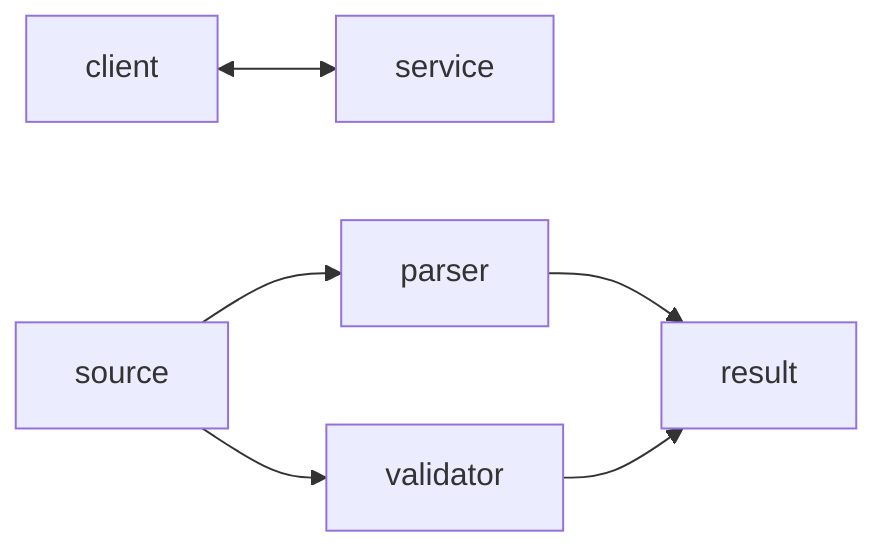
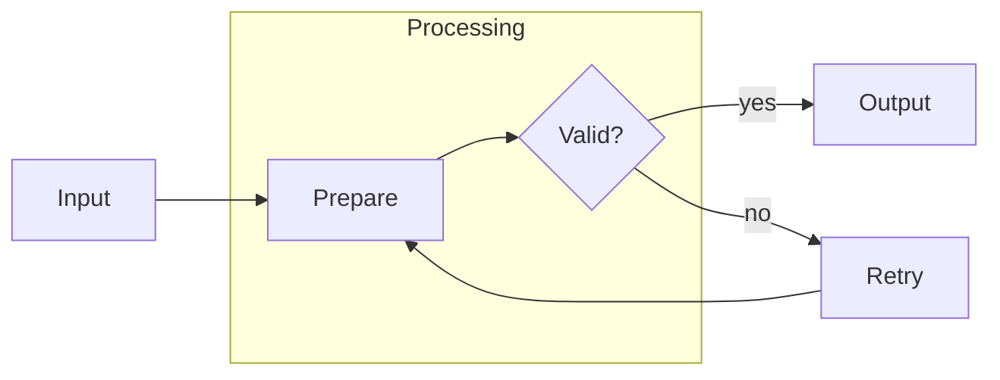

# Mermaid Flowchart Syntax Reference

Use this reference only for Mermaid flowcharts. Examples are compact, valid Mermaid blocks.

## Guardrails

- Keep each diagram focused on one flow; split unrelated flows.
- Apply the shared node and link rules, and avoid bare lowercase `end` in node syntax.
- Label decision outcomes, make intentional loops evident, and do not leave orphaned or unreachable nodes.
- When revising a diagram, preserve the meaning of its nodes and edges unless the requested change explicitly alters it.
- Identify the target renderer and version when compatibility matters; render when tooling is available, otherwise state that rendering was not verified.
- Stay within Mermaid flowchart syntax; do not add other diagram types, styling, or theming.

## Declaration and directions

Start with `flowchart` (or the compatible `graph`) and a direction: `TB` (top to bottom), `TD` (top down), `BT` (bottom to top), `LR` (left to right), or `RL` (right to left).

## Shared syntax

For Flowchart-style [nodes](nodes.md), labels, shapes, and [links](links.md), use the focused shared references.

Do not use bare lowercase `end` in node syntax: Mermaid recognizes it as the end of a `subgraph`. Use a safe ID and visible label such as `finish[End]` or `end_node["end"]` instead.

## Flowchart-specific link caveat

Because `o` and `x` immediately next to a link operator are parsed as circle and cross link endings, use spaces around operators (for example, `a --- oNode`) or capitalize the node ID; do not write `a---oNode` or `a---xNode`.

## Bidirectional links and fan-out/fan-in

Use a bidirectional arrow when the relationship genuinely flows both ways. For fan-out or fan-in, Mermaid lets one statement connect multiple nodes using `&`.

This is equivalent to declaring each individual edge, but is more compact for simple parallel relationships. Use separate links when each relationship needs a distinct label.

## Subgraphs

Use a `subgraph` to group a cohesive part of a flow. Give it a stable ID and a readable title. Nodes outside the group can link to nodes inside it and nodes inside it can link out.

When an edge runs from a node inside a subgraph to an external node, Mermaid ignores the subgraph's declared direction and uses the parent diagram direction; linking to the subgraph itself does not. Keep the group small and validate the rendered diagram rather than relying on forced layout.

## Explore further

This focused reference intentionally does not cover: expanded shape catalog, Markdown strings and automatic wrapping, edge IDs and animation, click interactions and security levels, accessibility titles and descriptions. See the [official Mermaid reference](https://mermaid.js.org/syntax/flowchart.html).

## Official documentation

- [Mermaid flowchart syntax](https://mermaid.js.org/syntax/flowchart.html)
