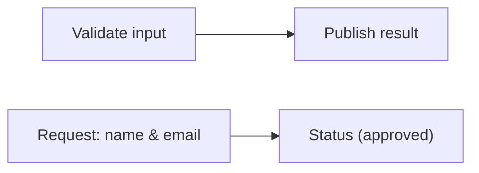
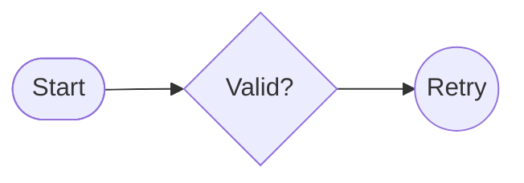

# Mermaid Flowchart-Style Nodes Reference

Use this reference only for Flowcharts and Swimlanes. It does not define generic Mermaid node syntax or apply to other diagram types.

## IDs and labels

An ID is an internal, reusable identifier; a label is visible text. Keep IDs stable when editing, use readable labels, and remember that repeated IDs reference the same node and the last declared label is used. Quote labels containing special characters, parser-significant punctuation, or literal text.

## Common shapes

Choose shapes sparingly to clarify meaning. Common Flowchart-style forms are:

| Meaning | Syntax |
| --- | --- |
| Rectangle | `id[Label]` or `id` |
| Rounded rectangle | `id(Label)` |
| Stadium | `id([Label])` |
| Decision | `id{Label}` |
| Circle | `id((Label))` |

## Guardrails

- Use stable, unique IDs for distinct nodes and clear labels for readers.
- Quote labels when their content could be parsed as syntax.
- Prefer the default rectangle unless a shape adds clear meaning.
- Confirm rendering when a shape is semantically important.

## Explore further

This focused reference intentionally does not cover: expanded shape catalog, Markdown strings and automatic wrapping, accessibility titles and descriptions, or diagram-specific grouping rules. See [Flowchart subgraphs](flowcharts.md#subgraphs) for Flowchart grouping; grouping rules remain diagram-specific. See the [official Flowchart reference](https://mermaid.js.org/syntax/flowchart.html) and [official Swimlane reference](https://mermaid.js.org/syntax/swimlanes.html).

## Official documentation

- [Mermaid flowchart syntax](https://mermaid.js.org/syntax/flowchart.html)
- [Mermaid swimlane syntax](https://mermaid.js.org/syntax/swimlanes.html)
