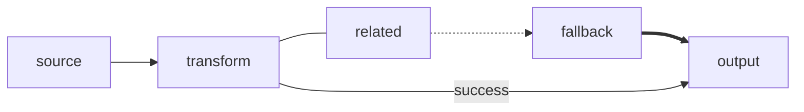

# Mermaid Shared Flowchart-Style Links Reference

Use this reference only for the link forms shared by Flowcharts and Swimlanes. It does not define generic Mermaid link syntax, apply to other diagram types, or replace Flowchart-specific link rules such as endpoint parsing, bidirectional links, fan-out/fan-in, and subgraph behavior in [the Flowchart reference](../behavior/flowcharts.md#flowchart-specific-link-patterns).

In Swimlanes, cross-lane links represent semantic handoffs and should be labeled.

## Common links

Use a solid arrow as the default for directed flow. A plain line has no arrowhead; use dotted or thick arrows only when their meaning is explicit and consistent. Label an arrow when the relationship needs explanation.

| Link | Syntax |
| --- | --- |
| Solid arrow | `a --> b` |
| Plain line | `a --- b` |
| Dotted arrow | `a -.-> b` |
| Thick arrow | `a ==> b` |
| Labeled arrow | `a -->|label| b` |

## Guardrails

- Use solid arrows by default for directed flow.
- Make dotted or thick link meaning explicit and consistent.
- Label relationships when the label carries important meaning.
- Do not add extra dashes merely to force layout.

## Explore further

This focused reference intentionally does not cover: Flowchart-specific bidirectional links, fan-out and fan-in, endpoint parsing, and subgraph edge behavior; edge IDs and animation; special edge types; click interactions; or other diagram-specific edge rules. See the [official Flowchart reference](https://mermaid.js.org/syntax/flowchart.html) and [official Swimlane reference](https://mermaid.js.org/syntax/swimlanes.html).

## Official documentation

- [Mermaid flowchart syntax](https://mermaid.js.org/syntax/flowchart.html)
- [Mermaid swimlane syntax](https://mermaid.js.org/syntax/swimlanes.html)
