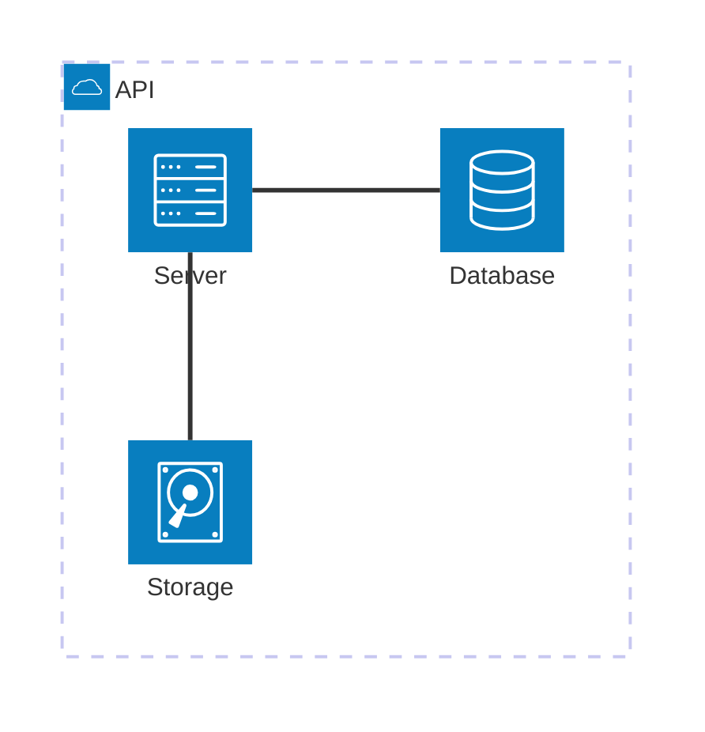

# Mermaid Architecture Diagram Syntax Reference

Use this reference only for Mermaid Architecture diagrams. They require Mermaid 11.1.0+.

## When to use Architecture diagrams

Use Architecture diagrams for high-level system services, components, groups, and their relationships, including deployment boundaries. Use a Flowchart for process or decision flow. Use C4 when its software-architecture abstraction levels and model-specific notation are required.

## Declaration and core elements

Start with `architecture-beta`. Declare groups before services or junctions that belong to them, and declare all referenced elements before their edges. Groups use `group id(icon)[Label]`; services use `service id(icon)[Label]` and may be placed with `in group_id`; junctions use `junction id` and may also use `in group_id`.

Use an icon in parentheses, such as `service db(database)[Database]`. Built-in icons include `cloud`, `database`, `disk`, and `server`; confirm the rendered icon set in the target renderer.

## Edges and layout

An edge names ports as `source:port arrow port:target`, where ports are `T`, `R`, `B`, or `L`; for example, `db:L -- R:server`. Use `--` for no arrowhead, `-->` or `<--` for one arrowhead, and `<-->` for both. A service-to-containing-group edge annotates each service endpoint with its containing group, such as `server{group}:B --> T:subnet{group}`.

Newer syntax requires compatible renderers: `randomize` is available from Mermaid 11.14.0+, layout tuning from 11.15.0+, and row/column alignment from 11.16.0+.

## Guardrails

- Model one coherent system boundary or architecture view.
- Use stable, unique IDs and readable labels.
- Keep groups as containment boundaries, not substitutes for process steps.
- Declare elements before connecting them, and use explicit ports when edge placement matters.
- Validate icons, ports, and newer syntax in the target renderer.

## Explore further

This focused reference intentionally does not cover: randomize behavior, layout tuning, row/column alignment, advanced icon configuration, themes/accessibility, and C4 model selection. See the [official Mermaid reference](https://mermaid.js.org/syntax/architecture.html).

## Official documentation

- [Mermaid Architecture diagram syntax](https://mermaid.js.org/syntax/architecture.html)
