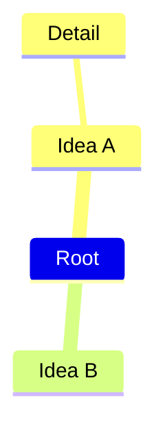

# Mermaid Mindmap Syntax Reference

Use this reference only for Mermaid mindmaps. Mindmap is experimental, and its syntax and properties can change. Since Mermaid 9.4.0, it is lazily loaded and asynchronously rendered; before that, the host must register `@mermaid-js/mermaid-mindmap`.

## When to use Mindmap

Use Mindmap for broad, radial or non-linear ideation, brainstorming, related concepts, and conceptual exploration. Use Tree View for strict containment hierarchy, Flowchart for directed flows or decisions, and Sequence diagram for temporal exchange.

## Declaration and basic grammar

Declare a mindmap with `mindmap`. Non-empty lines define nodes, and indentation defines parent-child relationships. Keep same-depth siblings at consistent indentation; relative indent widths matter, and ambiguous indentation uses the nearest clearly indicated parent.

## Node labels and shapes

Plain text is a node label with the default shape. To choose a shape, use an ID and label: square `id[Label]`, rounded `id(Label)`, or circle `id((Label))`. Traditional labels can use ` `; backtick Markdown labels support formatting, Unicode, automatic wrapping, and newlines.

## Guardrails

- Keep each map focused on one conceptual area.
- Use consistent indentation for each depth.
- Do not model cycles or cross-links as if a mindmap were a general graph.
- Avoid assuming icon fonts or custom classes exist in the target renderer.

## Pitfalls and compatibility

- Mindmap is experimental; confirm host renderer support and Mermaid version.
- Icon integration is experimental. Use `::icon(classes)` on the following indented line, and require registered icon classes.
- CSS classes use `:::class1 class2` and require host-provided CSS.
- Do not assert that a direction setting is available.
- Tidy Tree may be configured through frontmatter (`config: layout: tidy-tree`).

## Explore further

This focused reference intentionally does not cover: icon/class styling setup, full shape catalog, Tidy Tree configuration, themes/accessibility, and renderer integration. See the [official Mermaid reference](https://mermaid.js.org/syntax/mindmap.html).

## Official documentation

- [Mermaid mindmap syntax](https://mermaid.js.org/syntax/mindmap.html)
