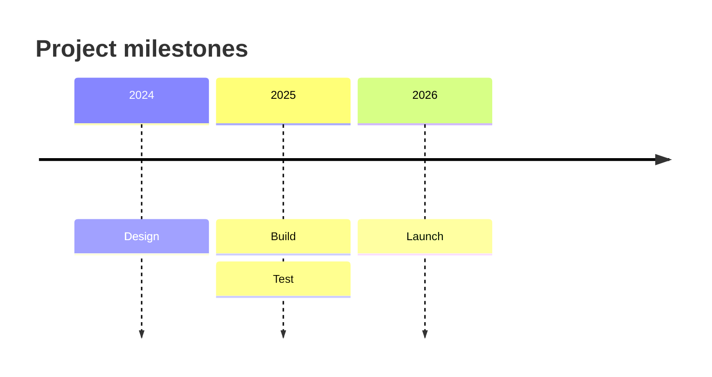

# Mermaid Timeline Syntax Reference

Use this reference only for Mermaid timelines. Timeline is experimental, and its syntax and properties can change; it uses experimental lazy loading and asynchronous rendering. Confirm the target renderer and Mermaid version, and render when tooling is available; otherwise state that rendering was not verified.

## When to use Timeline

Use Timeline for chronological events, milestones, periods, or historical progress. Use Sequence diagrams for messages between participants, Flowcharts for directed branching or processes, and Mindmaps for non-linear ideation.

## Declaration and basic grammar

Declare a timeline with `timeline`; its default direction is LR. `timeline TD` is supported from Mermaid 11.14.0+. Place `title <text>` immediately after the declaration. Periods and events use colon grammar.

Periods and events are plain text, not restricted to numeric dates. Preserve declaration order and do not expect chronological auto-sorting. After the first event, use extra `: <event>` segments or continuation lines beginning with `:`. `section <name>` starts a group whose following periods belong to it until the next section.

## Guardrails

- Use one coherent chronology per diagram.
- Write periods in chronological order yourself.
- Distinguish new periods from continuation events.
- Preserve colon grammar and readable continuation indentation.

## Pitfalls and compatibility

- Timeline is experimental; confirm target renderer support and Mermaid version, then render when possible.
- Title support is documented, but do not assume Timeline-specific accessibility attributes or alt-text syntax.
- Text wraps automatically; use ` ` to explicitly break a label line.
- `timeline TD` requires Mermaid 11.14.0+.
- Escape or replace content that conflicts with Mermaid syntax.

## Explore further

This focused reference intentionally does not cover: advanced section composition, multi-event formatting, TD layout, themes/accessibility, and renderer integration. See the [official Mermaid reference](https://mermaid.js.org/syntax/timeline.html).

## Official documentation

- [Mermaid timeline syntax](https://mermaid.js.org/syntax/timeline.html)
