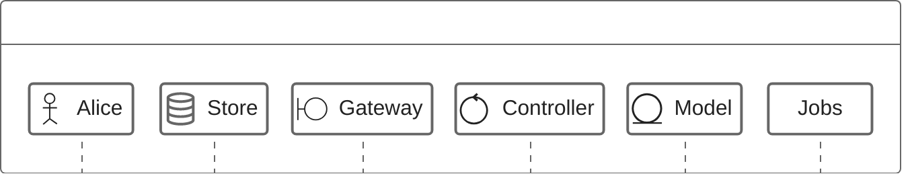
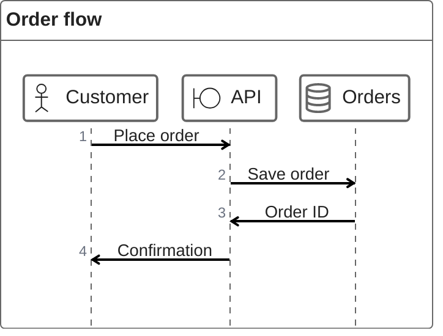

# Mermaid ZenUML Syntax Reference

This reference covers ZenUML participant annotators, not Google Cloud Platform annotators. ZenUML is distinct from Mermaid `sequenceDiagram`; it is experimental, lazily loaded, asynchronously rendered, and may require Mermaid 10 plus external registration of `@mermaid-js/mermaid-zenuml@0.1.0`. Confirm the target renderer and Mermaid version, and render when tooling is available; otherwise state that rendering was not verified.

## When to use ZenUML

Use ZenUML for concise object-oriented chronological interactions where message order, lifecycles, nested calls, and semantic participant roles matter. Use standard Sequence diagrams for standard Mermaid sequence syntax, and Flowcharts for branching processes.

## Declaration and basics

Declare a ZenUML diagram with `zenuml`. Participants are implicitly declared on first use; add an explicit participant line to control ordering. Use aliases such as `A as Alice`. A synchronous call is `A.method()`, with nested synchronous calls enclosed in braces; asynchronous messages use `Alice->Bob: Hello`, and `new Service` creates a participant. Use `result = A.method()` to capture a result and `return result` to return it. The asynchronous `@return` and `@reply` forms are rare.

## Participant annotators

Annotators replace the default participant rectangle: `@Actor` marks an actor, `@Database` a data store, `@Boundary` an external interface, `@Control` an orchestration component, `@Entity` a domain entity, and `@Queue` a message queue.

Do not invent additional or GCP-specific annotators.

## Guardrails

- Do not mix standard sequence syntax into ZenUML diagrams.
- Declare annotators before their participants are used.
- Keep aliases and IDs consistent.
- Preserve brace nesting for synchronous calls.
- Do not infer annotators beyond the official six.

## Pitfalls and compatibility

- ZenUML is experimental, lazily loaded, and asynchronously rendered; confirm target renderer and version.
- External registration of `@mermaid-js/mermaid-zenuml@0.1.0` may be needed.
- Malformed nesting fails parsing.
- `@return` is for one level upward and is rarely needed.

## Explore further

This focused reference intentionally does not cover: comments/Markdown, loops (`while`, `for`, `forEach`/`foreach`, `loop`), `if/else`, `opt`, `par`, and `try/catch/finally`. See the [official Mermaid reference](https://mermaid.js.org/syntax/zenuml.html).

## Official documentation

- [Mermaid ZenUML syntax](https://mermaid.js.org/syntax/zenuml.html)
